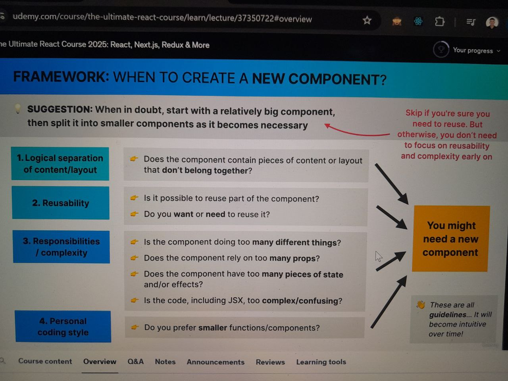
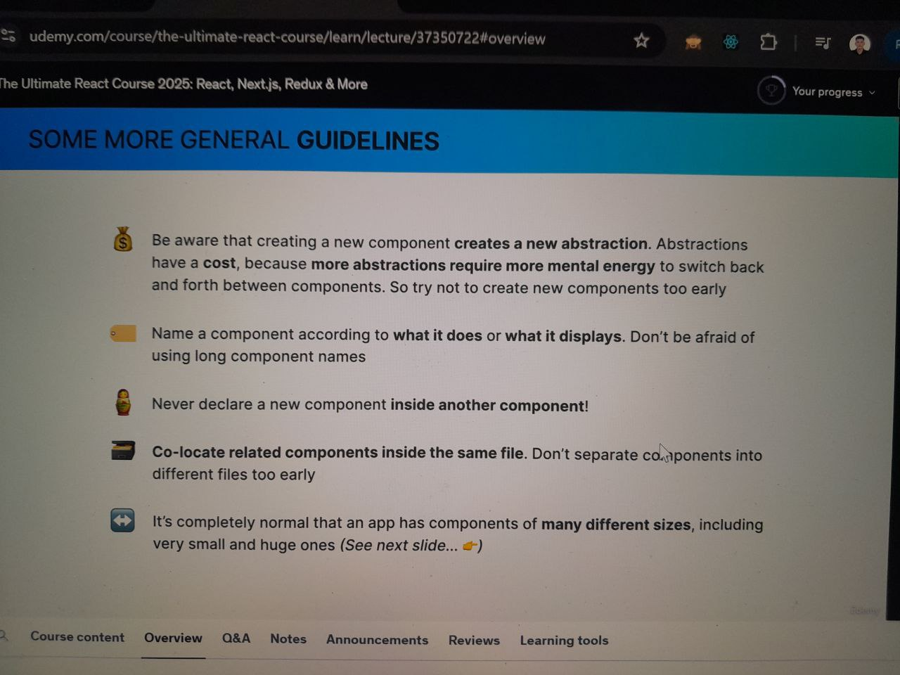
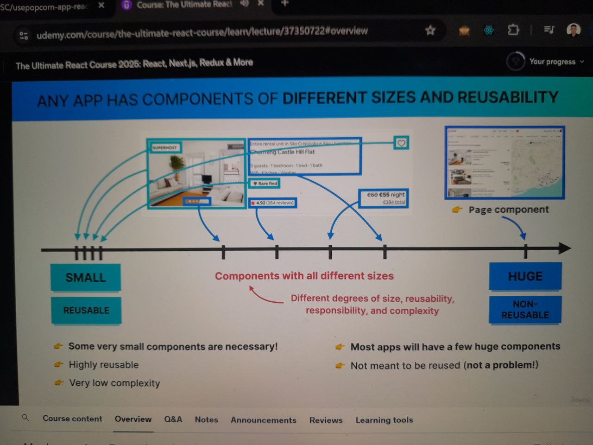
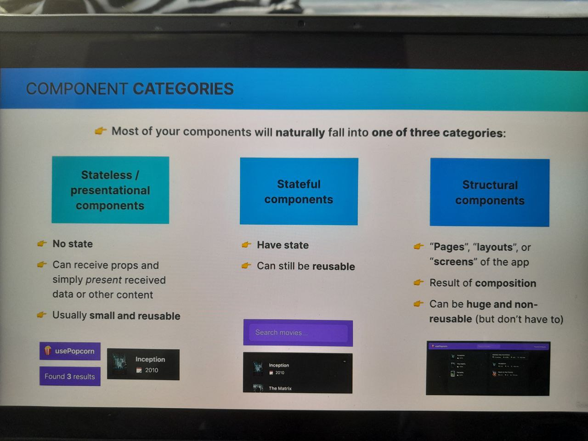
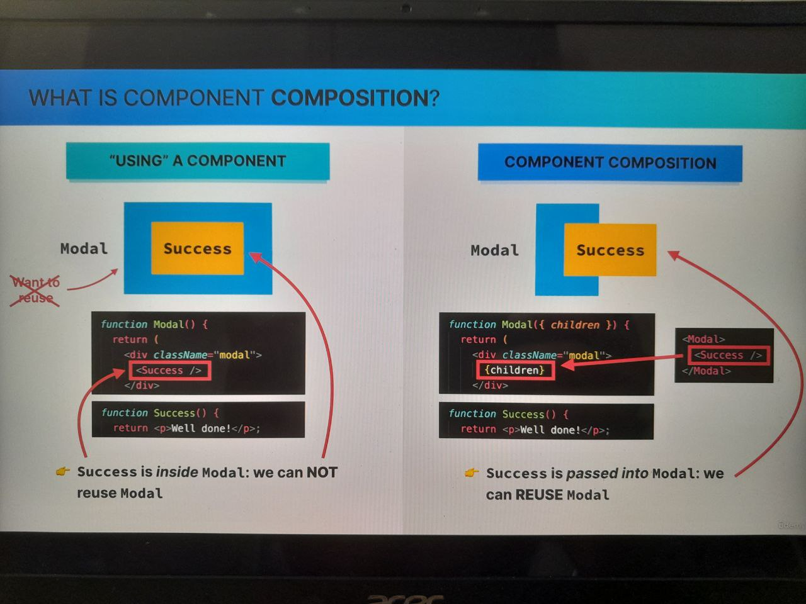
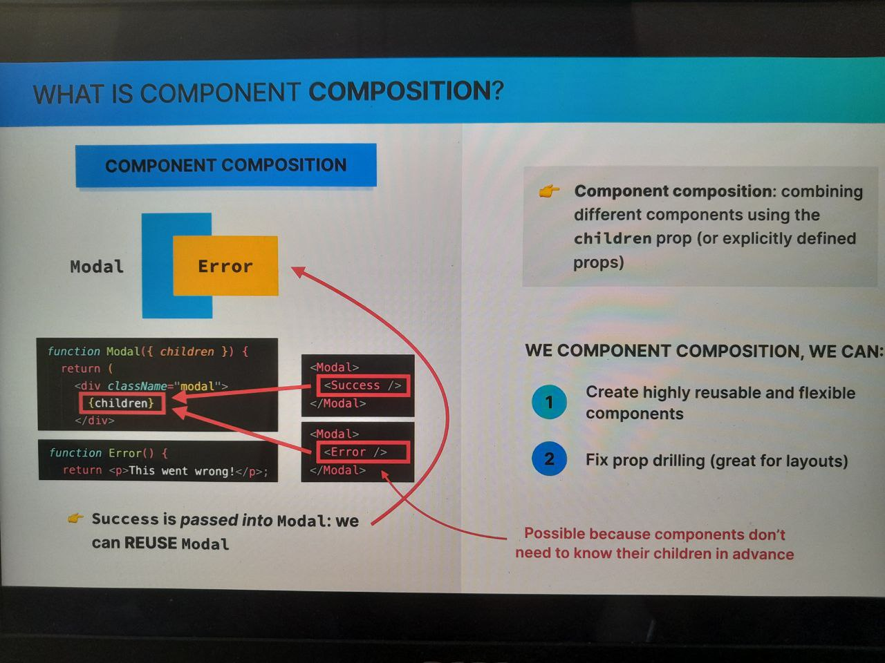

April 25, 2025

# SECTION 10: Thinking in React: Components, Composition, & Reusability

1. Section Overview

2. Project Setup a UsePopcorn App - a movie app api & Connect to Github Repo

3. How to Split a UI Into Components
   
   
   

4. Splitting Components in Practice

April 26, 2025

5. Component Categories
   

6. Prop Drilling - a several nested child components to get the data
   ex. const [movies, setMovies] = useState(tempMovieData);
   Main App -> Main -> List Box -> Movie List

7. Component Composition
   
   

8. Fixing Prop Drilling With Composition (And Building a Layout)
   Using children {children} prop is the key
